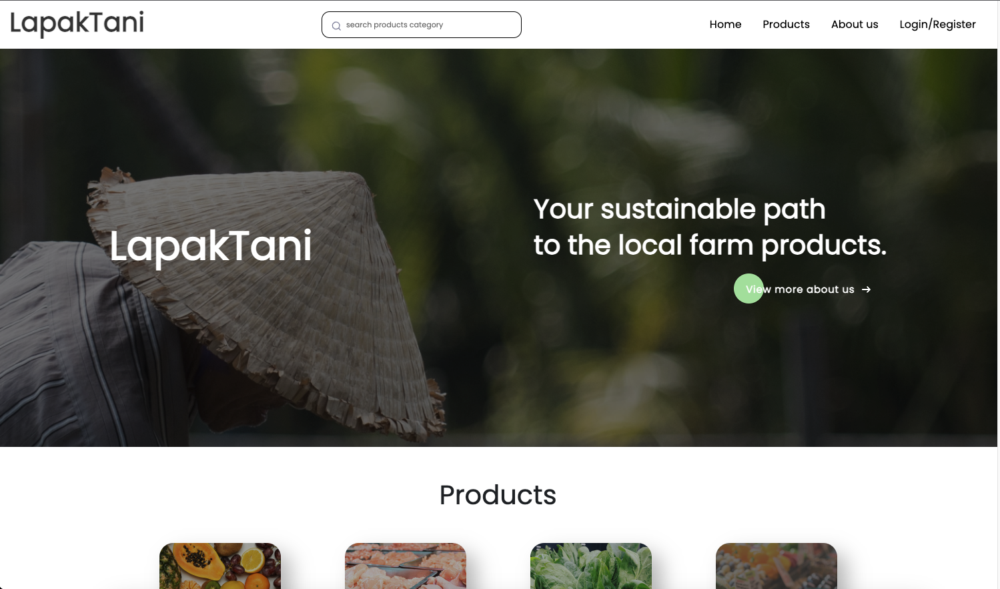

# [LapakTani](https://lapaktani.site/)

## Prerequisites
* Node.js installed on your machine.

## Installation
* Clone the repository.
* Run npm install to install the required dependencies.
* Rename .env.example to .env and fill in the required variables, including the local database connection details.
* Connect to the local database (i.e., mysql) and import the DBExample file.

## Usage
* Run npm start to start the server.
* Open http://localhost:3000 in your browser.
